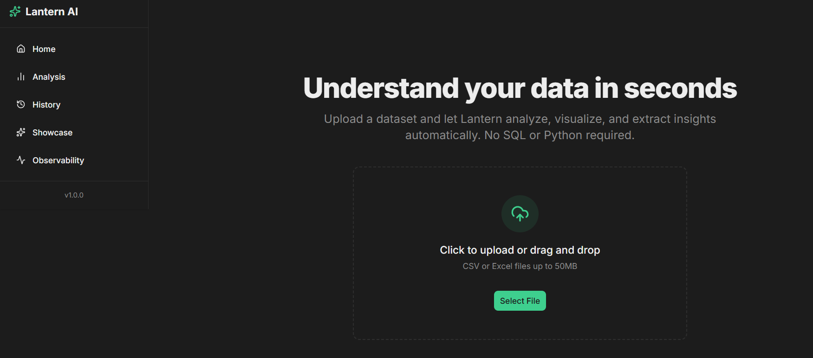
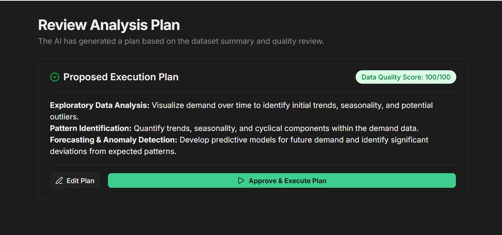
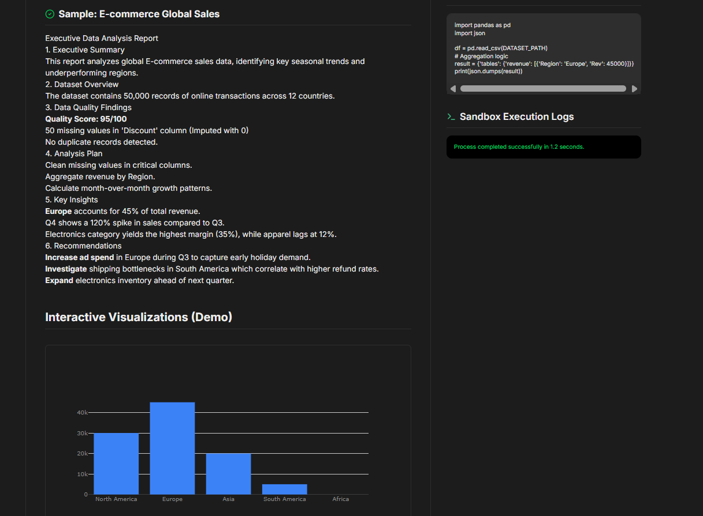
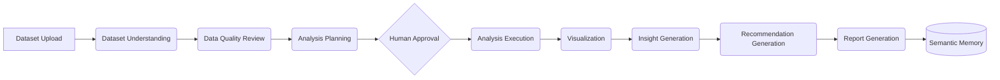
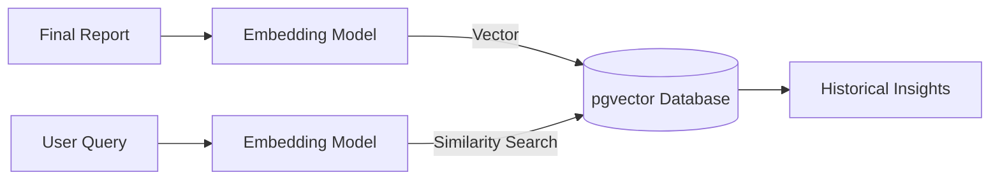

# Lantern

**Agentic Business Intelligence Platform powered by LangGraph**

Lantern is an advanced, multi-agent AI analytics platform designed to autonomously ingest, analyze, and visualize complex datasets. By leveraging a sophisticated LangGraph architecture with dynamic human-in-the-loop checkpoints, Lantern bridges the gap between autonomous code generation and executive-level business intelligence.

---

## Demo

### Dashboard


### Analysis Workflow


### Generated Report


### Semantic Search


---

## Key Features

* **Multi-Agent LangGraph Workflow**: A state-machine-driven orchestration of specialized agents handling distinct phases of the data lifecycle.
* **Human-in-the-Loop Planning**: The system proposes structured analysis plans that require human review and approval before execution, ensuring alignment and safety.
* **Dynamic Python Code Generation**: Autonomous generation of pandas and plotly code based on the approved analysis plan.
* **Secure Sandbox Execution**: Isolated execution of generated Python code to prevent side-effects and guarantee operational security.
* **Interactive Plotly Visualizations**: Dynamic, interactive charts embedded directly into the final executive reports.
* **Executive-Level Business Insights**: High-level interpretations of data metrics distilled for non-technical stakeholders.
* **Recommendation Generation**: Actionable, data-driven business recommendations produced by the Insight Agent.
* **PDF & Markdown Reports**: Beautifully formatted reports exportable for offline sharing and archiving.
* **Semantic Memory using pgvector**: Historical analyses are embedded and stored in a vector database for long-term intelligence retention.
* **Historical Analysis Search**: Natural language retrieval of past reports, enabling cross-dataset insights.
* **Workflow Observability Dashboard**: A React Flow interface providing real-time visualization of agent state transitions and graph execution.
* **Multi-LLM Support**: Built-in integrations for Gemini 2.5 Flash and OpenRouter (e.g., Nemotron 3), allowing flexible model selection.

---

## Architecture

```mermaid
graph TD
    User([User]) --> |Uploads Dataset & Prompts| Frontend
    
    subgraph Frontend [Frontend Application]
        UI[Next.js + TailwindCSS]
        Obs[React Flow Observability]
    end
    
    Frontend --> |API Requests| Backend
    
    subgraph Backend [FastAPI Backend]
        API[FastAPI Routers]
        API --> LangGraph[LangGraph State Machine]
        
        subgraph LangGraph Orchestration
            DU[Dataset Understanding Agent] --> DQ[Data Quality Agent]
            DQ --> AP[Analysis Planning Agent]
            AP --> |Interrupt| HIL{Human Approval}
            HIL --> |Resume| EX[Execution Agent]
            EX --> VZ[Visualization Agent]
            VZ --> IN[Insight Agent]
            IN --> RG[Reporting Agent]
        end
        
        LangGraph -.-> |State Persistence| CP[(Neon PostgreSQL Checkpoints)]
    end
    
    EX --> |Sandboxed Code| Sandbox[Python Sandbox]
    RG --> |Embed & Store| PGV[(pgvector Semantic Memory)]
    
    subgraph AI Providers
        Gemini[Gemini 2.5 Flash]
        OpenRouter[OpenRouter / Nemotron]
        Embed[text-embedding-004]
    end
    
    LangGraph Orchestration <--> AI Providers
```

---

## Agent Workflow



---

## Technology Stack

| Category | Technologies |
| :--- | :--- |
| **Frontend** | Next.js, TypeScript, TailwindCSS, shadcn/ui, React Flow, Plotly |
| **Backend** | FastAPI, LangGraph, LangChain |
| **Database** | PostgreSQL, Neon, pgvector |
| **AI** | Gemini 2.5 Flash, OpenRouter, text-embedding-004 |
| **Infrastructure**| Vercel, Render |

---

## Human-in-the-Loop Intelligence

Fully autonomous agents often hallucinate or execute misaligned objectives when faced with complex, open-ended datasets. Lantern solves this by implementing a **Human-in-the-Loop (HITL)** architecture:

1. The AI evaluates the dataset and generates a proposed analysis plan.
2. The LangGraph workflow intentionally **interrupts** and persists its state to PostgreSQL.
3. The user reviews, modifies, or directly approves the plan via the frontend.
4. Upon approval, the graph **resumes** execution.

This approach guarantees that the computationally expensive code generation and execution phases are strictly aligned with user intent, maximizing efficiency and safety.

---

## Semantic Memory

Lantern acts as a long-term intelligence hub for your organization. 

* **Embedding**: Final reports and insights are vectorized using Google's text-embedding models.
* **Storage**: Vectors and metadata are stored in a Neon PostgreSQL database utilizing the `pgvector` extension.
* **Retrieval**: Users can perform natural language semantic searches to instantly recall insights from past analyses, enabling historical context to inform future decisions.



---

## Observability

Understanding *why* an AI made a decision is just as important as the decision itself. Lantern features a dedicated observability dashboard built with **React Flow**. 

This interface provides real-time, node-level visibility into the LangGraph state machine, allowing engineers to trace execution paths, inspect agent inputs/outputs, monitor state transitions, and seamlessly debug complex multi-agent interactions.

---

## Example Analysis Lifecycle

1. **Dataset Upload**: A sales dataset is ingested and parsed.
2. **Analysis Plan Generation**: The AI identifies key metrics (e.g., MoM growth, regional performance).
3. **Human Approval**: The stakeholder reviews the plan and approves.
4. **Execution**: Python pandas code is generated and executed in a sandbox to compute the metrics.
5. **Visualization**: Interactive Plotly charts are generated for the metrics.
6. **Insight Production**: An LLM interprets the trends from the executed data.
7. **Recommendation Production**: Actionable business steps are proposed.
8. **Executive Report**: A beautifully formatted Markdown/PDF report is compiled.
9. **Semantic Memory**: The report is embedded and stored for future retrieval.

---

## Engineering Highlights

* Orchestrated a complex, multi-agent state machine using **LangGraph** to handle deterministic and non-deterministic workflows.
* Implemented resilient, persistent graph checkpoints using **PostgreSQL**, enabling seamless interruptions and resumptions.
* Designed a scalable **vector-based semantic retrieval** system using pgvector for long-term conversational memory.
* Engineered a dynamic code generation and secure sandbox execution pipeline for real-time **Python execution**.
* Built interactive, responsive business intelligence dashboards integrating **Plotly** and **React Flow**.
* Developed a robust observability and tracing layer for deep agent visibility.

---

## Future Roadmap

- [ ] Live workflow streaming
- [ ] Collaborative workspaces
- [ ] Multi-dataset analysis
- [ ] Scheduled reports
- [ ] Advanced agentic RAG
- [ ] Enterprise authentication

---

## Why Lantern?

Lantern represents the cutting edge of applied AI engineering. By combining the autonomous capabilities of **Agentic AI** with the structured, deterministic requirements of **Business Intelligence**, Lantern delivers a platform that is both powerful and reliable. 

The integration of **Semantic Memory** ensures that the system grows smarter over time, while **Human-in-the-Loop** checkpoints guarantee safety and alignment. Orchestrated by **LangGraph**, Lantern is not just a demo—it is a production-grade blueprint for the future of AI analytics.
